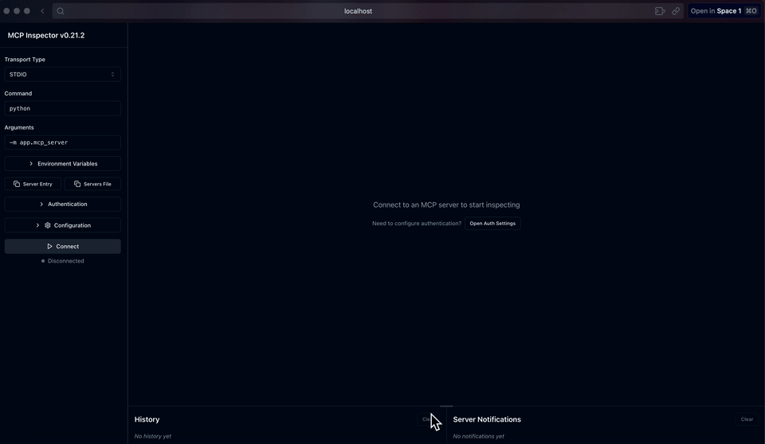
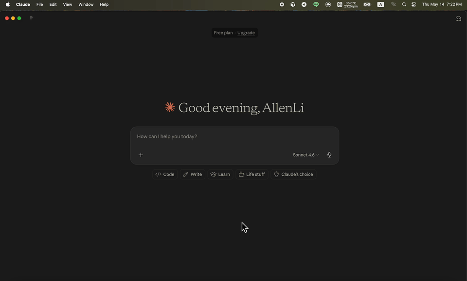

# ChatGPT Task Scheduler — Exercise

## Demo

### GIF




## How to Use

1. Read `PROMPT.md`
2. Answer the Design Questions (write your answers directly in `PROMPT.md`)
3. Build the prototype:
   - **Challenge Track:** Build from scratch using `PROMPT.md` as your spec
   - **Guided Track:** Go to `scaffold/`, fill in the TODOs
4. Verify with the MCP inspector tests at the bottom of `PROMPT.md`
5. Bring your Design Questions answers to live session for discussion

## Choose Your Track

**Challenge Track** — You decide the architecture, file structure, and implementation. Any language with an MCP SDK works (Python + the official `mcp` SDK recommended). Read `PROMPT.md` to get started.

**Guided Track** — File structure and boilerplate are provided. Fill in the core logic marked with `TODO`. Go to `scaffold/` and follow the instructions below.

## Guided Track Setup

```bash
cd scaffold
python3 -m venv .venv
source .venv/bin/activate
pip install -r requirements.txt
```

You also need **Node.js** for `npx` (used by the MCP inspector for verification).

### Files to Fill In

| File | TODO | Design Decision |
|------|------|-----------------|
| `app/scheduler.py` | `get_time_bucket()` + `find_due_jobs()` | Time bucket partitioning for efficient job scanning |
| `app/mcp_server.py` | `TOOL_REGISTRY` + `route_tool_call()` | Registry pattern for MCP tool routing |

### Run and Verify

The prototype is a real MCP stdio server. Verify with the MCP inspector (no Claude needed):

```bash
cd scaffold
source .venv/bin/activate
npx @modelcontextprotocol/inspector python -m app.mcp_server
```

This opens a browser GUI, usually at `http://localhost:5173`.

There are two ways to operate the scheduler:

1. **MCP Inspector GUI** — manually choose a tool, fill JSON arguments, and click **Run Tool**.
2. **Claude Desktop / Claude Code** — ask in natural language after connecting this MCP server.

Use ISO 8601 datetimes for scheduled times. Inputs without a timezone offset are treated as Taiwan time (`UTC+8`). You can still pass an explicit offset such as `+08:00` when you want to be unambiguous.

### Watch Structured Logs

The MCP server writes structured scheduler logs to `scaffold/scheduler.log`.
Keep this running in a second terminal while using the MCP inspector or Claude Desktop:

```bash
cd scaffold
tail -F scheduler.log
```

Useful demo events include:

- `scheduler.started` — the MCP server started the watcher and worker threads.
- `watcher.scan` — the watcher scanned for due jobs and reports `due_job_count`.
- `watcher.enqueue` — a due job was marked `queued` and pushed into the in-memory queue.
- `worker.execute` — the worker started executing a queued job.
- `worker.complete` — the worker completed a job.
- `tool.call` — an MCP tool call reached the server router.

If the log file does not exist yet, start the server or inspector first. `tail -F` will wait for the file to appear.

### Reset Demo Data

Stop the MCP server or inspector first, then delete the SQLite database:

```bash
cd scaffold
sqlite3 chatgpt_task.db "DELETE FROM jobs;"
```

The next server start will recreate the database tables automatically with `Base.metadata.create_all`.
If you also want to clear old logs before a recording:

```bash
rm -f scheduler.log
```

### MCP Inspector GUI Flow

In the browser GUI, click **Connect** first. The inspector should show the scheduler tools. Depending on the scaffold version, the visible tool names may appear as `task.create`, `task.list`, `task.status`, `task.cancel`, or as `task_create`, `task_list`, `task_status`, `task_cancel`. Use the names shown by the inspector.

1. Create an already-due task, then confirm it completes:
   ```json
   {
     "description": "Create an already-due task",
     "scheduled_at": "2026-05-14T18:25:00+08:00"
   }
   ```
   Select `task.create` or `task_create`, then click **Run Tool**.

   Expected result:
   ```json
   {
     "job_id": 1,
     "status": "pending",
     "scheduled_at": "2026-05-14 18:25:00+08:00"
   }
   ```

   Wait about 10 seconds, then check the task status:
   ```json
   {
     "job_id": 1
   }
   ```
   Select `task.status` or `task_status`, then click **Run Tool**.

   Expected result: the task should become `completed`, with a result similar to:
   ```json
   {
     "job_id": 1,
     "description": "Create an already-due task",
     "status": "completed",
     "scheduled_at": "2026-05-14 18:25:00+08:00",
     "result": "Executed: Create an already-due task"
   }
   ```

2. Create a future task, then confirm it runs after the scheduled time:
   ```json
   {
     "description": "Future task that should run soon",
     "scheduled_at": "2026-05-14T18:26:00+08:00"
   }
   ```
   Select `task.create` or `task_create`, then click **Run Tool**. Record the returned `job_id`.

   Expected initial result:
   ```json
   {
     "job_id": 2,
     "status": "pending",
     "scheduled_at": "2026-05-14 18:26:00+08:00"
   }
   ```

   After the scheduled time passes, wait about 10 seconds, then check the task status:
   ```json
   {
     "job_id": 2
   }
   ```
   Select `task.status` or `task_status`, then click **Run Tool**.

   Expected result:
   ```json
   {
     "job_id": 2,
     "description": "Future task that should run soon",
     "status": "completed",
     "scheduled_at": "2026-05-14 18:26:00+08:00",
     "result": "Executed: Future task that should run soon"
   }
   ```

3. Create a future task, then cancel it before it runs:
   ```json
   {
     "description": "Future demo task to cancel",
     "scheduled_at": "2026-05-14T18:30:00+08:00"
   }
   ```
   Select `task.create` or `task_create`, then click **Run Tool**. Record the returned `job_id`.

   Expected initial result:
   ```json
   {
     "job_id": 3,
     "status": "pending",
     "scheduled_at": "2026-05-14 18:30:00+08:00"
   }
   ```

   Cancel the future task:
   ```json
   {
     "job_id": 3
   }
   ```
   Replace `3` with the `job_id` returned in the previous step. Select `task.cancel` or `task_cancel`, then click **Run Tool**.

   Expected result:
   ```json
   {
     "job_id": 3,
     "status": "cancelled"
   }
   ```

   List all tasks:
   ```json
   {}
   ```
   Select `task.list` or `task_list`, then click **Run Tool**. The response should include job `1` and job `2` as `completed`, and job `3` as `cancelled`.

Once the inspector tests pass, you can optionally connect to Claude Desktop / Claude Code (instructions also in `PROMPT.md`).

### Tool Naming Note

The product spec uses dot-separated names such as `task.create`, and the MCP tool-name guidance allows dots. See:

- MCP tool names: https://modelcontextprotocol.io/specification/2025-11-25/server/tools#tool-names
- SEP-986 discussion: https://github.com/modelcontextprotocol/modelcontextprotocol/issues/986

Some Claude Desktop versions have been observed to apply stricter client-side validation, allowing only letters, digits, and underscores. A related discussion with the observed validation error is here:

- Claude client validation issue: https://github.com/modelcontextprotocol/go-sdk/issues/169

For Claude Desktop compatibility, this scaffold exposes underscore tool names:

- `task_create`
- `task_list`
- `task_status`
- `task_cancel`

The internal router still keeps dot-name aliases such as `task.create`, so the implementation can support the product naming convention while remaining usable in Claude Desktop.

### Claude Desktop Demo Flow

Use this section as a recording script for a Claude Desktop demo. It mirrors the MCP Inspector GUI flow, but the user action is natural-language chat instead of manually selecting tools and filling JSON.

Before recording:

1. Finish the Claude Desktop MCP config in `~/Library/Application Support/Claude/claude_desktop_config.json`.
2. Fully quit and reopen Claude Desktop so it reloads the MCP server.
3. Start a new chat.
4. Confirm the tool icon shows the Task Scheduler tools:
   - `task_create`
   - `task_list`
   - `task_status`
   - `task_cancel`

Use ISO 8601 timezone offsets in the prompts. For Taiwan time, use `+08:00`.

#### Demo 1: Create an already-due task

In Claude Desktop, type:

```text
請建立一個任務，時間是 2026-05-14T18:25:00+08:00，內容是 Create an already-due task。
```

Expected Claude Desktop behavior:

1. Claude asks to use the `task_create` tool.
2. Click **Allow**.
3. Claude shows a tool result similar to:
   ```json
   {
     "job_id": 1,
     "status": "pending",
     "scheduled_at": "2026-05-14 18:25:00+08:00"
   }
   ```

Wait about 10 seconds, then type:

```text
請查詢 job_id 1 的狀態。
```

Expected Claude Desktop behavior:

1. Claude asks to use the `task_status` tool.
2. Click **Allow**.
3. The result should show `completed` and include:
   ```json
   {
     "job_id": 1,
     "description": "Create an already-due task",
     "status": "completed",
     "result": "Executed: Create an already-due task"
   }
   ```

#### Demo 2: Create a future task and let it run

Choose a time about 1 minute in the future, then type:

```text
請建立一個任務，時間是 2026-05-14T18:26:00+08:00，內容是 Future task that should run soon。
```

Expected Claude Desktop behavior:

1. Claude asks to use the `task_create` tool.
2. Click **Allow**.
3. The result should show a new `job_id` with status `pending`.

After the scheduled time passes, wait about 10 seconds, then type:

```text
請查詢 job_id 2 的狀態。
```

Expected Claude Desktop behavior:

1. Claude asks to use the `task_status` tool.
2. Click **Allow**.
3. The result should show `completed` and include:
   ```json
   {
     "job_id": 2,
     "description": "Future task that should run soon",
     "status": "completed",
     "result": "Executed: Future task that should run soon"
   }
   ```

#### Demo 3: Create a future task and cancel it

Choose a later future time so there is enough time to cancel it, then type:

```text
請建立一個任務，時間是 2026-05-14T18:30:00+08:00，內容是 Future demo task to cancel。
```

Expected Claude Desktop behavior:

1. Claude asks to use the `task_create` tool.
2. Click **Allow**.
3. The result should show a new `job_id` with status `pending`.

Before the scheduled time arrives, type:

```text
請取消 job_id 3。
```

Expected Claude Desktop behavior:

1. Claude asks to use the `task_cancel` tool.
2. Click **Allow**.
3. The result should show:
   ```json
   {
     "job_id": 3,
     "status": "cancelled"
   }
   ```

#### Demo 4: List all tasks

In the same chat, type:

```text
請列出 Task Scheduler 裡所有任務。
```

Expected Claude Desktop behavior:

1. Claude asks to use the `task_list` tool.
2. Click **Allow**.
3. The result should include all demo jobs:
   - job `1`: `completed`
   - job `2`: `completed`
   - job `3`: `cancelled`

If your database already contains older demo jobs, the list may include more than three rows. For a clean recording, delete `scaffold/chatgpt_task.db` before starting the server.

## Bonus Challenges

- Connect a real LLM to parse natural language task descriptions before calling `task.create`
- Add recurring job support (cron expressions)
- Add job chaining (Job A completes -> triggers Job B)
- Add MCP `resources` support (e.g., expose job details as readable resources)
- Add MCP `prompts` support (e.g., a `daily_review` prompt template)
