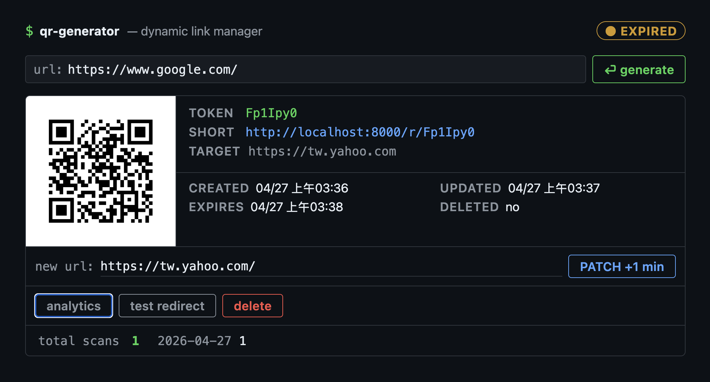
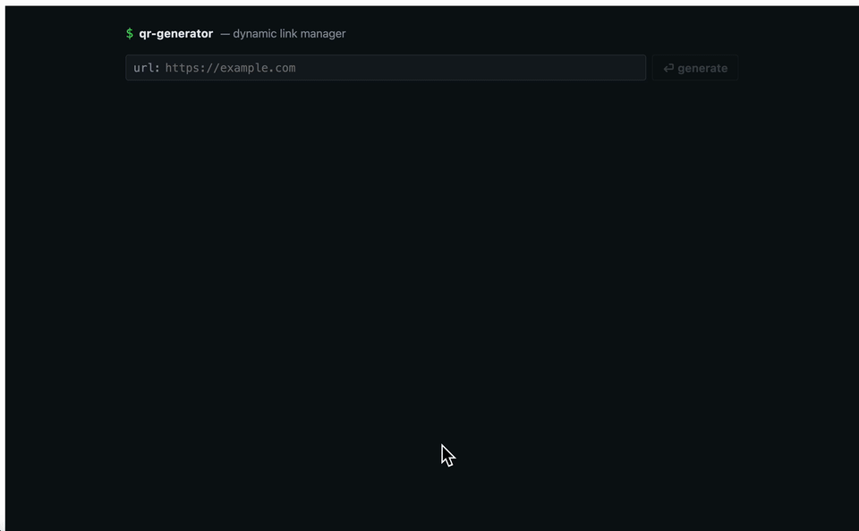

# QR Code Generator

A dynamic QR code system built with Python + FastAPI (backend) and React + TypeScript (frontend).

## Demo

### Image


### GIF


---

## Features

- Submit a long URL → receive a short URL token + QR code image
- QR code encodes the short URL which 302-redirects to the original URL
- Update the target URL after creation
- Soft delete (returns 410 on redirect)
- Optional expiration timestamp with live countdown
- In-memory cache (cache-first redirect strategy)
- Scan analytics (total count + per-day breakdown)
- URL validation: length check, scheme check, blocklist, normalization

---

## Tech Stack

| Layer    | Technology                        |
|----------|-----------------------------------|
| Backend  | Python 3.10+, FastAPI, SQLAlchemy |
| Database | SQLite                            |
| Frontend | React 18, TypeScript, Vite        |
| QR       | qrcode[pil]                       |

---

## Project Structure

```
scaffold/
├── app/
│   ├── main.py          # FastAPI app, CORS, static file serving
│   ├── database.py      # SQLAlchemy engine + session
│   ├── models.py        # UrlMapping, ScanEvent
│   ├── schemas.py       # Pydantic request/response types
│   ├── routes.py        # All API endpoints
│   ├── token_gen.py     # SHA-256 + Base62 token generation
│   └── url_validator.py # URL validation + normalization
├── frontend/
│   └── src/
│       └── App.tsx      # Single-page React UI
└── requirements.txt
```

---

## Getting Started

**Prerequisites:** Python 3.10+, Node.js 18+

```bash
cd scaffold
```

**Backend**

```bash
python3 -m venv .venv
source .venv/bin/activate
pip install -r requirements.txt
```

**Environment**

```bash
cp .env.example .env
```

Edit `.env` if needed. The default works for local dev on the same machine.
If you want to scan the QR code from a phone on the same network, set `BASE_URL`
to your laptop's LAN IP (e.g. `http://192.168.1.42:8000`) and start the backend
with `--host 0.0.0.0` (see below).

**Frontend**

```bash
cd frontend
npm install
npm run dev -- --host   # exposes dev server on LAN (port 5173)
```

**Start backend**

```bash
# Default (localhost only)
uvicorn app.main:app --reload --port 8000

# LAN-accessible — required when scanning QR code from a phone
uvicorn app.main:app --reload --port 8000 --host 0.0.0.0
```

Open `http://localhost:5173` in your browser (or `http://<your-lan-ip>:5173` from a phone).

---

## API Reference

| Method   | Path                        | Description                              |
|----------|-----------------------------|------------------------------------------|
| `POST`   | `/api/qr/create`            | Create QR code, returns token + URLs     |
| `GET`    | `/r/{token}`                | 302 redirect (410 if deleted/expired)    |
| `GET`    | `/api/qr/{token}`           | Get mapping info                         |
| `PATCH`  | `/api/qr/{token}`           | Update target URL and/or expiry          |
| `DELETE` | `/api/qr/{token}`           | Soft delete                              |
| `GET`    | `/api/qr/{token}/image`     | QR code PNG image                        |
| `GET`    | `/api/qr/{token}/analytics` | Total scans + per-day breakdown          |
| `GET`    | `/api/qr/{token}/check`     | Check redirect status without recording scan |

**404 vs 410:** `/r/{token}` returns 410 for deleted or expired tokens, 404 for tokens that never existed.

---

## Exercise Track

This project was built as a guided coding exercise. The original scaffold contained three TODOs:

| File              | TODO                | Concept                              |
|-------------------|---------------------|--------------------------------------|
| `token_gen.py`    | `generate_token()`  | SHA-256 + Base62 + collision retry   |
| `url_validator.py`| `validate_url()`    | Normalization + blocklist            |
| `routes.py`       | `redirect()`        | Cache → DB → 302 / 410 / 404         |

Design questions and answers are in `PROMPT.md`.
